# 🚀 **CI/CD Deployment — MLOps Iris Classifier**

This branch extends the **MLOps Iris Classifier** pipeline into a **fully automated CI/CD deployment** using **Docker**, **Kubernetes**, and **CircleCI**.
It represents the **fifth and final workflow stage**, where the trained model and Flask application are containerised, pushed to **Google Artifact Registry**, and deployed on **Google Kubernetes Engine (GKE)** — all triggered automatically from **CircleCI**.

<p align="center">
  
</p>


## 🧩 **Overview**

This stage integrates everything built so far — data processing, model training, Flask app deployment — into an end-to-end MLOps system with continuous integration and delivery.
CircleCI orchestrates the **build → push → deploy** workflow, ensuring every new commit automatically triggers:

1. Docker image build
2. Push to Artifact Registry
3. Deployment update in GKE

### 🔍 Core Components

| Component                       | Description                                                                 |
| ------------------------------- | --------------------------------------------------------------------------- |
| **Dockerfile**                  | Builds the container image for the Flask app.                               |
| **kubernetes-deployment.yaml**  | Defines Kubernetes Deployment and Service for the app.                      |
| **.circleci/config.yml**        | CI/CD pipeline that builds, pushes, and deploys automatically via CircleCI. |
| **Google Cloud Platform (GCP)** | Hosts the container registry and managed Kubernetes cluster (GKE).          |
| **CircleCI**                    | Handles build, authentication, and deployment automation.                   |


## 🗂️ **Updated Project Structure**

```text
mlops_iris_classifier/
├── .circleci/
│   └── config.yml                 # CircleCI pipeline configuration (build, push, deploy)
├── artifacts/
│   ├── raw/
│   ├── processed/
│   └── models/
├── pipeline/
│   └── training_pipeline.py       # Orchestrates data preparation and model training
├── src/
│   ├── data_processing.py
│   ├── model_training.py
│   ├── logger.py
│   └── custom_exception.py
├── templates/
│   └── index.html                 # Flask web app UI
├── static/
│   ├── style.css
│   └── img/app_background.jpg
├── img/
│   ├── flask/
│   └── circle_ci/
├── Dockerfile
├── kubernetes-deployment.yaml
├── app.py
├── pyproject.toml
├── setup.py
└── requirements.txt
```


## ☁️ **1. Google Cloud Platform Setup**

### Step 1: Enable Required APIs

Go to **GCP Console → Navigation Menu → APIs & Services → Library**, and enable:

* Kubernetes Engine API
* Google Container Registry API
* Compute Engine API
* Cloud Build API
* Cloud Storage API
* Identity and Access Management (IAM) API

### Step 2: Create a GKE Cluster

1. In GCP, search **Kubernetes Engine**.
2. Go to **Clusters → + Create**.
3. Choose **Autopilot (Managed)** → **Configure**.
4. Keep default settings for **Cluster Basics** and **Fleet Registration**.
5. In **Networking**, ensure both options are ticked:

   * ✅ Access using DNS
   * ✅ Access using IPv4 addresses
6. Click **Create** and wait for provisioning.


### Step 3: Create a Service Account

1. Go to **IAM & Admin → Service Accounts → + CREATE SERVICE ACCOUNT**.
2. Name it `mlops-iris`.
3. Click **Create and Continue**.
4. Grant roles:

   * Owner
   * Storage Object Admin
   * Storage Object Viewer
   * Artifact Registry Administrator
   * Artifact Registry Writer
5. Click **Done**.
6. Under **Actions → Manage Keys → Add Key → Create New Key**, choose **JSON**.
7. Move the downloaded file to your project root and rename it:

   ```bash
   mv ~/Downloads/your-key.json gcp-key.json
   ```


### Step 4: Create an Artifact Registry

1. Go to **Navigation Menu → Artifact Registry**.
2. Click **+ CREATE REPOSITORY**.
3. Name it `mlops-iris`.
4. Select region `us-central1`.
5. Keep defaults → **Create**.


## 🐳 **2. Docker and Kubernetes Setup**

### Step 1: Dockerfile

```dockerfile
FROM python:3.12
WORKDIR /app
COPY . /app
RUN pip install --no-cache-dir -e .
EXPOSE 5000
ENV FLASK_APP=app.py
CMD ["python", "app.py"]
```


### Step 2: kubernetes-deployment.yaml

```yaml
# Kubernetes Deployment
apiVersion: apps/v1
kind: Deployment
metadata:
  name: mlops-iris
spec:
  replicas: 2
  selector:
    matchLabels:
      app: mlops-iris
  template:
    metadata:
      labels:
        app: mlops-iris
    spec:
      containers:
        - name: mlops-iris
          image: us-central1-docker.pkg.dev/sacred-garden-474511-b9/mlops-iris/mlops-iris:latest
          ports:
            - containerPort: 5000

# Kubernetes Service
---
apiVersion: v1
kind: Service
metadata:
  name: mlops-service
spec:
  selector:
    app: mlops-iris
  ports:
    - protocol: TCP
      port: 80
      targetPort: 5000
  type: LoadBalancer
```


## 🔄 **3. CircleCI Setup**

### Step 1: Create `.circleci/config.yml`

```yaml
version: 2.1
executors:
  docker-executor:
    docker:
      - image: google/cloud-sdk:latest
    working_directory: ~/repo

jobs:
  checkout_code:
    executor: docker-executor
    steps:
      - checkout

  build_docker_image:
    executor: docker-executor
    steps:
      - checkout
      - setup_remote_docker
      - run:
          name: Install Docker CLI
          command: |
            apt-get update && apt-get install -y docker.io
      - run:
          name: Authenticate with Google Cloud
          command: |
            echo "$GCLOUD_SERVICE_KEY" | base64 --decode > gcp-key.json
            gcloud auth activate-service-account --key-file=gcp-key.json
            gcloud auth configure-docker us-central1-docker.pkg.dev --quiet
      - run:
          name: Build and Push Image
          command: |
            docker build -t us-central1-docker.pkg.dev/$GOOGLE_PROJECT_ID/mlops-iris/mlops-iris:latest .
            docker push us-central1-docker.pkg.dev/$GOOGLE_PROJECT_ID/mlops-iris/mlops-iris:latest

  deploy_to_gke:
    executor: docker-executor
    steps:
      - checkout
      - run:
          name: Authenticate with Google Cloud
          command: |
            echo "$GCLOUD_SERVICE_KEY" | base64 --decode > gcp-key.json
            gcloud auth activate-service-account --key-file=gcp-key.json
      - run:
          name: Configure GKE
          command: |
            gcloud container clusters get-credentials "$GKE_CLUSTER" \
              --region "$GOOGLE_COMPUTE_REGION" \
              --project "$GOOGLE_PROJECT_ID"
      - run:
          name: Deploy to GKE
          command: |
            kubectl apply -f kubernetes-deployment.yaml

workflows:
  version: 2
  deploy_pipeline:
    jobs:
      - checkout_code
      - build_docker_image:
          requires:
            - checkout_code
      - deploy_to_gke:
          requires:
            - build_docker_image
```


### Step 2: Set Up CircleCI

1. Visit [https://circleci.com](https://circleci.com) → create a free account.
2. Create a new organisation → **New Project**.

<p align="center">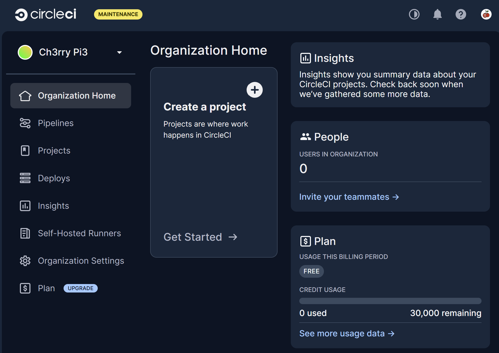</p>

3. Select **“Build, test, and deploy your software application.”**

<p align="center">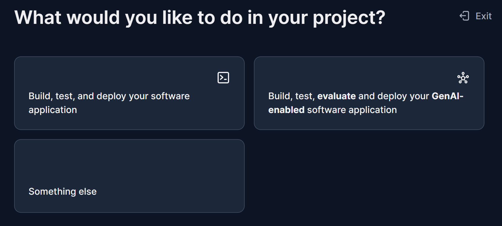</p>

4. Name your project.

<p align="center">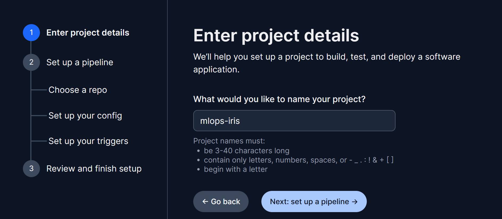</p>

5. Choose your GitHub repository.

<p align="center">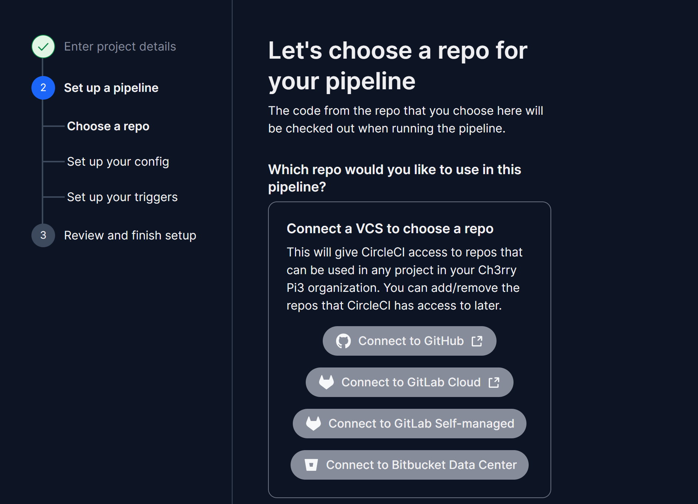</p>
<p align="center">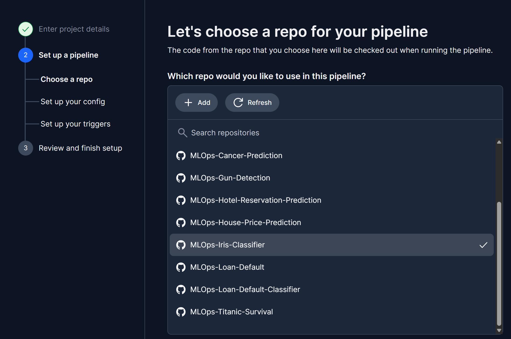</p>

6. CircleCI detects `.circleci/config.yml`.

<p align="center">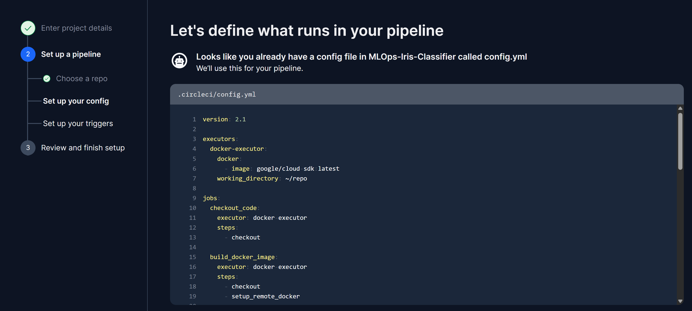</p>

7. Leave default **Triggers**.

<p align="center">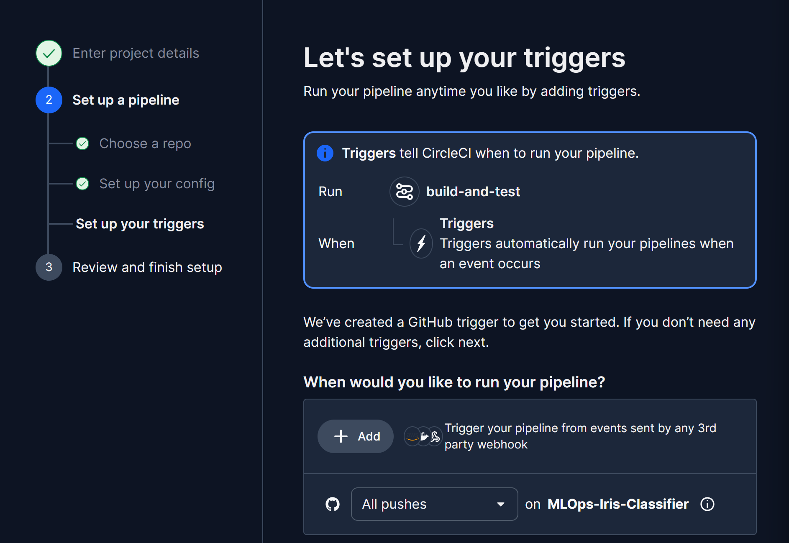</p>

8. Finish setup.

<p align="center">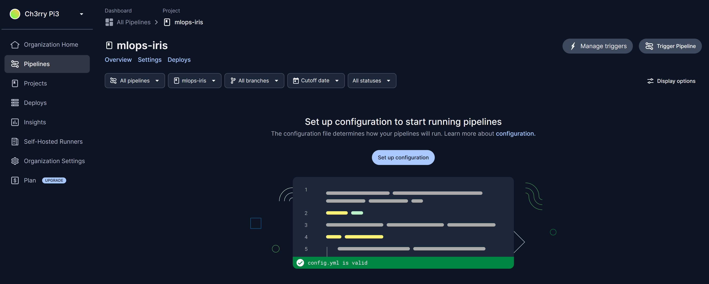</p>


## 🔐 **4. Configure Environment Variables**

### Step 1: Base64 Encode Your GCP Key

```bash
cat gcp-key.json | base64 -w 0
```

Copy the output string.


### Step 2: Add Variables in CircleCI

Go to **Project Settings → Environment Variables**.

<p align="center">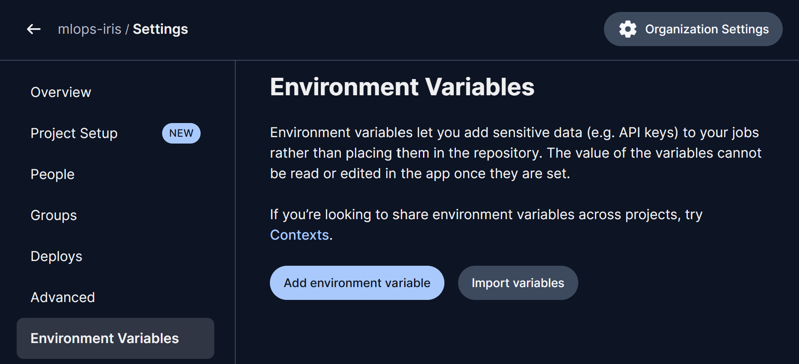</p>

| Name                    | Value                          |
| ----------------------- | ------------------------------ |
| `GCLOUD_SERVICE_KEY`    | (paste base64-encoded key)     |
| `GOOGLE_PROJECT_ID`     | e.g. `sacred-garden-474511-b9` |
| `GKE_CLUSTER`           | e.g. `autopilot-cluster-1`     |
| `GOOGLE_COMPUTE_REGION` | e.g. `us-central1`             |

<p align="center">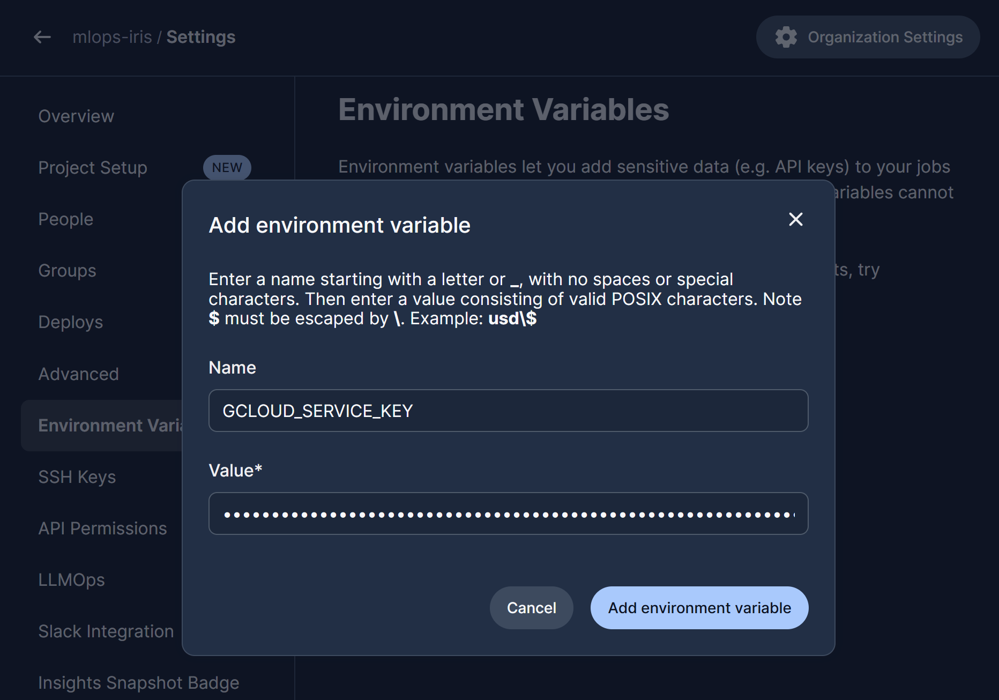</p>
<p align="center">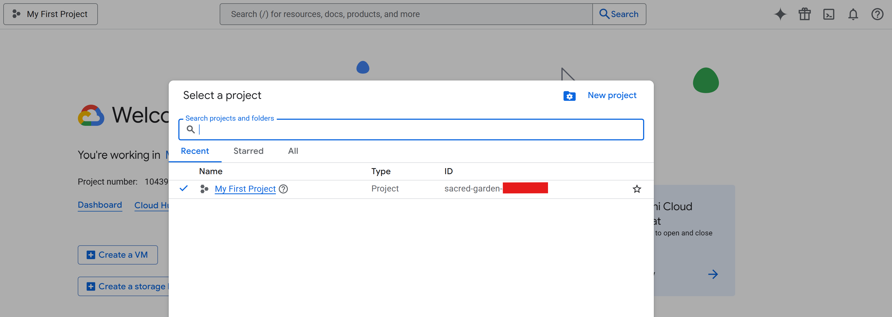</p>

---

## ⚙️ **5. Trigger the Pipeline**

Back in CircleCI, click **“Trigger Pipeline.”**

<p align="center">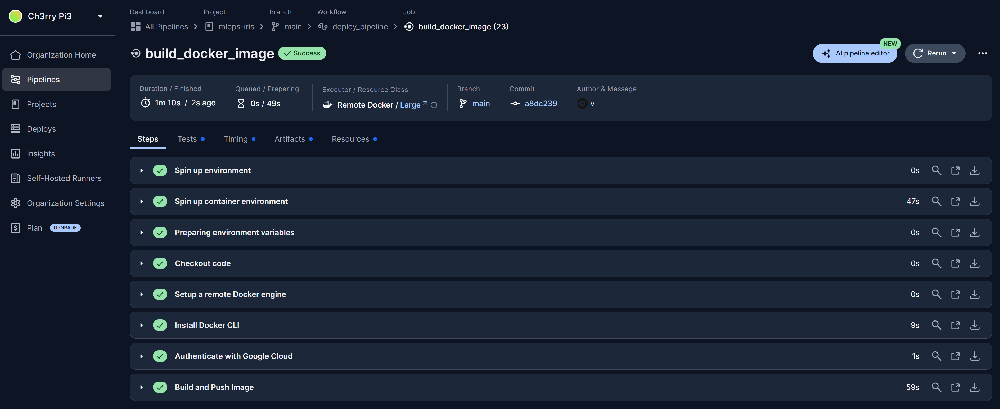</p>

After a successful run, your application is automatically deployed to GKE.


## ☸️ **6. Verify Deployment in GKE**

1. Go to **Kubernetes Engine → Workloads**.
   You should see your deployment:

   <p align="center">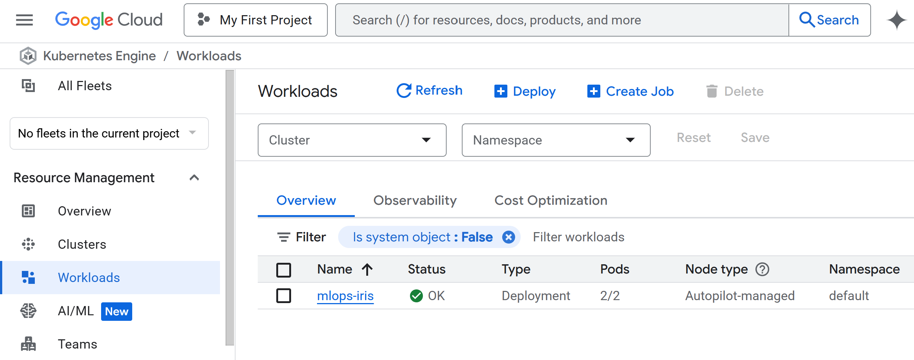</p>

2. Click `mlops-iris` to view details.

3. Scroll to **Exposing Services** to see the **Endpoint URL**:

   <p align="center"></p>

4. Click the endpoint to open the live Flask app:

   <p align="center"></p>


## ✅ **In Summary**

| Stage                     | Description                                         |
| ------------------------- | --------------------------------------------------- |
| **Data & Model Pipeline** | Fully automated via `pipeline/training_pipeline.py` |
| **Containerisation**      | Dockerised Flask app with model and assets          |
| **Deployment**            | GKE-managed cluster via CircleCI                    |
| **Automation**            | CI/CD pipeline runs on push to main                 |
| **Access**                | Public endpoint via LoadBalancer                    |

Your **MLOps Iris Classifier** is now a complete **end-to-end production pipeline**, from dataset → model → container → CI/CD → live deployment.
Every component is **automated, versioned, and reproducible** — a true production-ready MLOps system.
